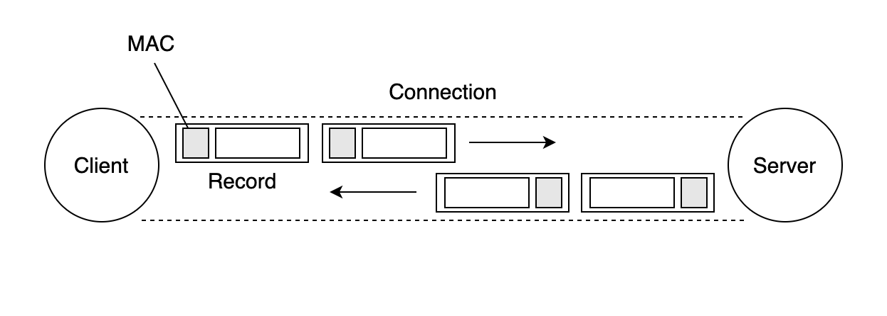

# Architecture

This document describes the high-level architecture of thttps. It helps you to familiar with the code base. 

thttps enables client and server makes the TCP connection. Thorugh the connection each sends encrypted chunk of data called 'record' to the others with MAC for checking data integrity.

## Code Map

This section talks briefly about various role of files and data structures.

- **`pkg/tls/handshake_cllient`, `pkg/tls/handshake_server` :** 

  If you are interested in how TLS handshake work, this is the place. These two files shows how client and server handshake before they transfer data to each other.

  `Conn` plays major job such as send, receive handshake message. `Conn` uses `halfConn` to encrypt, decrypt message and MAC validation.

- **`pkg/tls/conn`:**

  You can the definition of data structure of `Conn` , `halfConn` and its internal logic to encrypt, decrypt data. 

- **`pkg/tls/handshake_messages`:**

  You can find the whole hand shake messages structure such as ClientHello, ServerHello and its serialize, deserialize logics

